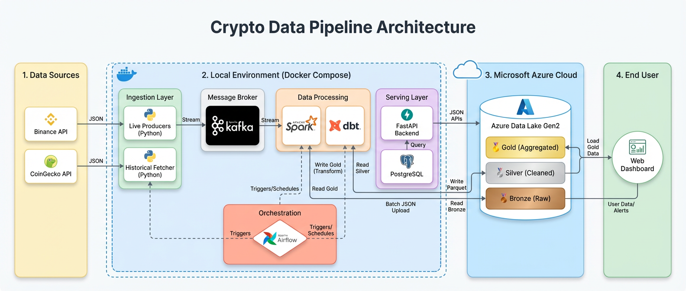

<div align="center">

# 🚀 Crypto-Pulse

**A Highly Scalable, Real-Time & Historical Cryptocurrency Data Engineering Pipeline powered by Microsoft Azure.**

</div>



Welcome to **Crypto-Pulse**, an advanced end-to-end data engineering project designed to ingest, process, and analyze cryptocurrency market data in real time. Built on the **Microsoft Azure Stack** and following the industry-standard **Medallion Architecture (Bronze ➔ Silver ➔ Gold)**, this pipeline ensures data flows reliably from source APIs all the way to analytics-ready dashboards.

---

## 🧬 Pipeline Architecture Overview

The system is built around 4 main environments working together:

| Layer | Technology | Status |
|-------|-----------|--------|
| **Data Ingestion (Bronze)** | Python, Binance API, CoinGecko API, Apache Kafka | ✅ Complete |
| **Spark Processing (Bronze→Silver)** | Apache Spark 3.5, Spark Structured Streaming, Parquet/Delta | 🚧 Bronze Done · Silver Pending |
| **Orchestration** | Apache Airflow 2.7 | ❌ Not Started |
| **Gold Layer & Analytics** | dbt, Azure Synapse | ❌ Not Started |
| **Serving** | FastAPI, PostgreSQL | ❌ Not Started |

### The Azure Medallion Layers:
- 🥉 **Bronze Layer:** Raw JSON data captured directly from APIs, stored as-is in **Azure Data Lake Storage Gen2 (ADLS Gen2)** using **Parquet** format (schema-on-read). Delta Lake upgrade is planned.
- 🥈 **Silver Layer:** Data cleaned, typed, and normalized using **Apache Spark**. Deduplication, timestamp normalization, and JSON parsing applied. **(Pending — `silver_processor.py` not yet implemented.)**
- 🥇 **Gold Layer:** Business-level aggregations, KPIs, and metrics built via **dbt** models, serving the API and dashboards. **(Pending.)**

---

## 📡 The Ingestion Layer

Three specialized Python agents in `ingestion/` power the Bronze layer:

### ⚡ The Live Reporter (`ingestion/producers/producer_binance.py`)
> *"Never misses a heartbeat of the market."*

- **Status:** ✅ Complete
- **Does:** Maintains a persistent, live connection to Binance to capture every price tick in real-time for **10 major crypto pairs** (BTC, ETH, BNB, XRP, ADA, SOL, DOT, DOGE, MATIC, LINK).
- **How:** Uses **WebSockets** (`wss://stream.binance.com:9443/ws`) with a **Bulletproof Auto-Reconnect** engine using exponential backoff (1s → 2s → 4s → ... → 60s max).
- **Output:** Publishes every price update to Kafka topic: `crypto.realtime.prices`
  ```json
  {"symbol": "BTCUSDT", "price": 68500.0, "volume_24h": 12345.6, "timestamp": 1712750400000, "source": "binance"}
  ```

### 📊 The Strategic Analyst (`ingestion/producers/producer_coingecko.py`)
> *"Surveys the entire market every 60 seconds."*

- **Status:** ✅ Complete
- **Does:** Periodically fetches macro-market data (Market Cap, Total Volume, Price Change %) for the **Top 100 coins by market cap**.
- **How:** Uses the `schedule` library to poll the CoinGecko REST API every 60 seconds. Handles Rate Limiting (HTTP 429) gracefully.
- **Output:** Publishes market overview snapshots to Kafka topic: `crypto.market.data`

### 🕰️ The Historian (`ingestion/historical/historical_fetcher.py`)
> *"Captures the past so we can learn from it."*

- **Status:** ✅ Complete
- **Does:** Downloads years of historical OHLCV candlestick data for the **Top 20 cryptocurrencies** starting from January 2021.
- **How:** Uses `ThreadPoolExecutor` (5 parallel workers) for concurrent API calls with **Retry Logic** for Rate Limit errors (HTTP 429).
- **Output:** Saves raw JSON arrays to `data/historical/<symbol>_raw_klines.json` — no transformation.

### 📰 The News Watcher (`ingestion/producers/producer_news.py`)
> *"Tracks what the world is saying about crypto."*

- **Status:** ❌ Not Started (Ahmed Ayman)
- **Goal:** Fetch news headlines and sentiment data from NewsAPI → Kafka topic: `crypto.news`

---

## ⚙️ Data Processing Layer

Located in `processing/`, this layer handles transforming raw Bronze data into business-ready insights.

### 🔥 Spark Jobs (`processing/spark_jobs/`)

#### `bronze_consumer.py` ✅ Complete (Yassin Mahmoud)
Kafka → Spark Structured Streaming → Bronze Layer (ADLS Gen2)

- Connects to Kafka topic `crypto.realtime.prices` using **Spark Structured Streaming**
- Authenticates to ADLS Gen2 via **OAuth2 / Service Principal** (`ClientCredsTokenProvider`)
- Preserves full raw payload in `raw_value` column — true schema-on-read
- Columns captured: `kafka_key`, `raw_value`, `topic`, `partition`, `offset`, `kafka_timestamp`, `ingested_at`
- Writes to ADLS path: `abfss://datalake@stcryptopulsedev2.dfs.core.windows.net/bronze/prices`
- Checkpoint at: `.../checkpoints/bronze/prices`
- Trigger: every **30 seconds**
- Format: **Parquet** *(Delta Lake upgrade is the next step)*
- Packages used: `hadoop-azure:3.3.4`, `wildfly-openssl:1.1.3.Final`, `spark-sql-kafka-0-10_2.12:3.5.0`

> **⚠️ Note:** Delta Lake config is present but commented out. Format is currently `parquet`. Upgrading to Delta is Task 2.3 in Yassin's task file.

#### `silver_processor.py` ❌ Not Started (Yassin Mahmoud)
- Will read Bronze Parquet files, apply cleaning/transformation, and write to the Silver container partitioned by `year/month/day`

#### `historical_loader.py` ❌ Not Created (Yassin Mahmoud)
- Will batch-load historical JSON files from `data/historical/` into Bronze ADLS as a one-time Spark job

### 🧱 dbt Models (`processing/dbt/`)
- **`dbt_project.yml`**: Empty — config not yet added (Karim)
- **`models/`**: Empty — no staging or gold models yet (Karim)
- **Status:** ❌ Not Started

---

## 🎼 Orchestration (`dags/`)

- **`etl_pipeline_dag.py`**: ❌ Empty — Airflow DAG not yet implemented (Yassin)
  - Will orchestrate: historical load → bronze streaming trigger → silver batch → dbt gold models

---

## 🗄️ Backend & Database

Located in `backend/app/`:

- **`main.py`**: ❌ Empty — FastAPI app not yet implemented (Mostafa)
- **`models/schema.sql`**: ✅ Complete (Karim Ahmed) — PostgreSQL schema with tables: `users`, `watchlists`, `alerts`, `portfolios`
- **`routers/`**: ❌ Not started
- **`services/`**: ❌ Not started

---

## 🐳 Docker Infrastructure

Located in `docker-compose.yml` and `spark-apps/Dockerfile.spark`:

### `docker-compose.yml` ✅ Defined (Mostafa)
All services are defined on a shared `crypto-net` network:

| Service | Port | Status |
|---------|------|--------|
| zookeeper | 2181 | ✅ Configured |
| kafka | 9092 | ✅ Configured |
| kafka-ui | 8080 | ✅ Configured |
| postgres | 5432 | ✅ Configured |
| airflow-webserver | 8081 | ✅ Configured |
| airflow-scheduler | — | ✅ Configured |
| spark-master | 7077 / 8082 | ✅ Configured |
| spark-worker | 8083 | ✅ Configured |
| backend (FastAPI) | 8000 | ✅ Configured |

> **⚠️ Known Issue:** `KAFKA_ADVERTISED_LISTENERS` is set to `localhost:9092`. For internal Docker communication between services (e.g., Spark → Kafka), this needs to be `kafka:9092`. Update required.

### `spark-apps/Dockerfile.spark` ✅ Exists
- Custom Spark Docker image with pre-installed JARs for Kafka + Azure ADLS connectivity
- A corresponding `.env` and the `bronze_consumer.py` are present in `spark-apps/`

---

## 📂 Repository Structure

```text
crypto-pulse/
├── ingestion/                          # Bronze layer data agents
│   ├── historical/
│   │   └── historical_fetcher.py       ✅ Fetches years of OHLCV data
│   └── producers/
│       ├── producer_binance.py         ✅ Real-time WebSocket price stream → Kafka
│       ├── producer_coingecko.py       ✅ Periodic market data poller → Kafka
│       └── producer_news.py            ❌ News & sentiment fetcher (not started)
│
├── processing/                         # Silver & Gold layer jobs
│   ├── spark_jobs/
│   │   ├── bronze_consumer.py          ✅ Kafka → Parquet on ADLS Bronze
│   │   ├── silver_processor.py         ❌ Empty — Bronze → Silver (not started)
│   │   └── historical_loader.py        ❌ Does not exist yet
│   └── dbt/
│       ├── dbt_project.yml             ❌ Empty — not configured yet
│       ├── models/                     ❌ No models yet
│       └── tests/                      ❌ No tests yet
│
├── backend/                            # REST API
│   └── app/
│       ├── main.py                     ✅ Basic FastAPI setup with /health endpoint
│       ├── models/schema.sql           ✅ PostgreSQL schema (users, watchlists, alerts, portfolios)
│       ├── routers/                    ❌ Not started
│       └── services/                   ❌ Not started
│
├── dags/
│   └── etl_pipeline_dag.py             ❌ Empty — Airflow DAG not implemented
│
├── spark-apps/                         # Docker Spark runtime files
│   ├── Dockerfile.spark                ✅ Custom Spark image with Kafka + Azure JARs
│   ├── bronze_consumer.py              ✅ Same as processing/spark_jobs (Docker copy)
│   ├── .env                            ✅ Azure + Kafka credentials for Docker
│   └── .env.example                   ✅ Template
│
├── data/historical/                    📦 Local Bronze JSON files (20 coins)
├── docs/                               📖 Architecture diagrams & task docs
├── ml/                                 ❌ ML models (not started)
├── notebooks/                          📔 EDA Jupyter notebooks (not started)
├── frontend/                           ❌ Web Dashboard (not started)
├── docker-compose.yml                  🐳 Local: Kafka, Spark, Airflow, Postgres
├── Makefile                            ⚡ make up / make down / make logs
├── requirements.txt                    📦 Python dependencies
├── .env.example                        🔑 Environment variables template
└── README.md                           📖 This file
```

---

## 🛠️ Setup & Installation

### Prerequisites
- **Python 3.10+**
- **Docker** and **Docker Compose**
- **Git**

### 1. Clone the Repository
```bash
git clone https://github.com/Amr-Walid/Depi-Project.git
cd Depi-Project/crypto-pulse
```

### 2. Configure Environment Variables
```bash
cp .env.example .env
# Fill in your Azure credentials and API keys
```

Required variables in `.env`:
```env
KAFKA_BOOTSTRAP_SERVERS=localhost:9092
KAFKA_TOPIC_REALTIME_PRICES=crypto.realtime.prices

AZURE_CLIENT_ID=<your-service-principal-client-id>
AZURE_CLIENT_SECRET=<your-service-principal-secret>
AZURE_TENANT_ID=<your-tenant-id>
AZURE_STORAGE_ACCOUNT_NAME=stcryptopulsedev2
AZURE_STORAGE_CONTAINER_NAME=datalake
```

### 3. Start Local Infrastructure
```bash
make up
# Starts: Kafka, Zookeeper, Spark, Airflow, PostgreSQL, Kafka-UI, Backend API
```

### 4. Install Python Dependencies
```bash
python -m venv venv
venv\Scripts\activate        # Windows
# source venv/bin/activate   # Mac/Linux

pip install -r requirements.txt
```

---

## 🚀 Running the Pipeline

```bash
# 1. Pull historical data for all 20 cryptocurrencies → data/historical/
python ingestion/historical/historical_fetcher.py

# 2. Start real-time Binance price streaming → Kafka topic: crypto.realtime.prices
python ingestion/producers/producer_binance.py

# 3. Start periodic CoinGecko market polling (every 60s) → Kafka topic: crypto.market.data
python ingestion/producers/producer_coingecko.py

# 4. Submit Bronze Spark job (inside Docker)
docker compose exec spark-master \
  spark-submit \
    --packages org.apache.hadoop:hadoop-azure:3.3.4,org.apache.spark:spark-sql-kafka-0-10_2.12:3.5.0 \
    /opt/spark-apps/bronze_consumer.py
```

**Useful Docker commands:**
```bash
make up       # Start all services
make down     # Stop all services
make logs     # Follow live logs
make restart  # Restart everything
```

**Access UIs:**
| Service | URL |
|---------|-----|
| Kafka UI | http://localhost:8080 |
| Airflow | http://localhost:8081 |
| Spark Master | http://localhost:8082 |
| FastAPI Backend | http://localhost:8000/docs |

---

## 🤝 The Team

Crypto-Pulse is proudly developed as a capstone project for the **DEPI (Digital Egypt Pioneers Initiative)** program — Microsoft Azure Data Engineering Track.

| Name | Role | Current Status |
|------|------|---------------|
| 🧑‍💻 **Amr Walid** | Team Lead & Lead Data Engineer | ✅ Milestone 1 Complete |
| 🧑‍💻 **Yassin Mahmoud** | DataOps & Spark Engineer | 🚧 Bronze ✅ · Silver ❌ · DAG ❌ |
| 🧑‍💻 **Mostafa Matar** | Backend Engineer & Docker Owner | ✅ Milestone 1 Complete |
| 🧑‍💻 **Karim Ahmed** | Analytics Engineer (dbt & PostgreSQL) | 🚧 Schema ✅ · dbt Setup ⏳ |
| 🧑‍💻 **Ahmed Ayman** | Data Analyst & ML Engineer | ❌ Not Started |

---

<div align="center">
  <b>Built with ❤️ for Data Engineering & The Crypto Ecosystem — DEPI 2025.</b>
</div>
