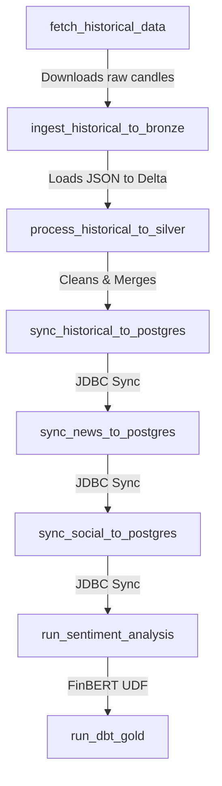
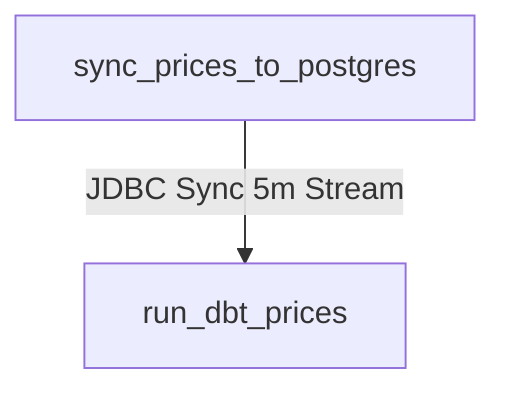

# Apache Airflow DAG Workflows

This directory houses the **Directed Acyclic Graphs (DAGs)** that orchestrate the pipeline executions for data synchronization, FinBERT sentiment scoring, and dbt analytic builds.

---

## Directory Structure

```
dags/
├── dag_historical_daily.py   # Daily batch DAG: history, sentiment, and core metrics
└── dag_prices_frequent.py    # 5-minute interval DAG: live price sync and dbt models
```

---

## DAG 1: `dag_historical_daily` (Daily Batch)

This DAG is scheduled to run once every day (`@daily`) and is responsible for pulling historical candles, syncing news/social feeds, running PySpark ML models, and materializing gold reporting tables.

### Workflow Sequence



---

## DAG 2: `dag_prices_frequent` (5-Minute Sync)

This DAG triggers every 5 minutes (`*/5 * * * *`) to keep the frontend dashboard updated with real-time price tickers.

### Workflow Sequence



---

## Configuration Details

Both DAGs run via `BashOperator` but target execution on the separate `spark-master` container:
*   **Docker Execution**: Command syntax runs as `docker exec spark-master spark-submit ...`.
*   **JAR Preloading**: The custom Spark worker container contains all needed Azure Storage, Kafka connectors, and PostgreSQL JDBC driver JARs natively under `/opt/spark/jars/`.
*   **Environment Handling**: Credentials like database endpoints, passwords, and Azure client keys are populated via system env variables passed straight to the containers from `.env`.
