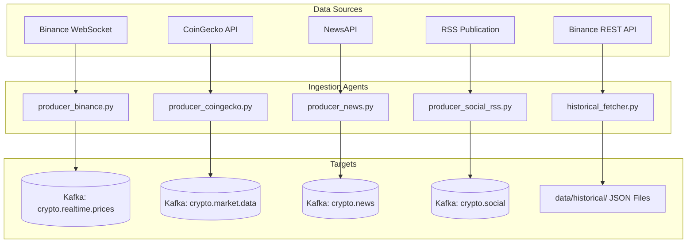
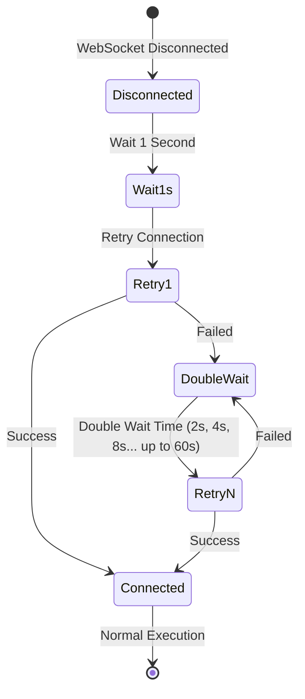

# Data Ingestion Layer (Producers)

This directory houses the python-based ingestion scripts responsible for fetching real-time streams, polling market intelligence REST APIs, downloading multi-year historical candles, and publishing these payloads to Kafka event streams.

---

## Directory Structure

```
ingestion/
├── historical/
│   └── historical_fetcher.py   # Multi-threaded batch historical OHLCV downloader
└── producers/
    ├── producer_binance.py     # Live Binance WebSocket price feed -> Kafka
    ├── producer_coingecko.py   # CoinGecko market stats poller -> Kafka
    ├── producer_news.py        # NewsAPI headline fetcher -> Kafka
    └── producer_social_rss.py  # RSS feed sentiment compiler -> Kafka
```

---

## Ingestion Data Pipeline



---

## Ingestion Agent Specifications

### 1. Real-Time Prices (`producers/producer_binance.py`)
*   **Protocol**: persistent secure WebSockets (`wss://stream.binance.com:9443/ws`).
*   **Pairs Tracked**: BTC, ETH, BNB, XRP, ADA, SOL, DOT, DOGE, MATIC, LINK (quoted against USDT).
*   **Frequency**: Sub-second ticker broadcasts.
*   **Target Kafka Topic**: `crypto.realtime.prices`
*   **Payload Schema**:
    ```json
    {
      "symbol": "BTCUSDT",
      "price": 68500.0,
      "volume_24h": 12345.6,
      "timestamp": 1712750400000,
      "source": "binance"
    }
    ```

### 2. Market Intelligence (`producers/producer_coingecko.py`)
*   **Protocol**: HTTP REST API polls.
*   **Parameters**: Top 100 cryptocurrencies sorted by market capitalization.
*   **Frequency**: Executed every 60 seconds.
*   **Target Kafka Topic**: `crypto.market.data`

### 3. Cryptocurrency News Feed (`producers/producer_news.py`)
*   **Protocol**: HTTP REST endpoints (NewsAPI).
*   **Frequency**: Fetches new headlines every 15 minutes.
*   **Target Kafka Topic**: `crypto.news`

### 4. Media Sentiment Compiler (`producers/producer_social_rss.py`)
*   **Protocol**: XML Parser polling RSS news directories.
*   **Outlets Covered**: CoinTelegraph, NewsBTC, and Bitcoin.com.
*   **Frequency**: Executed every 10 minutes.
*   **Target Kafka Topic**: `crypto.social`

### 5. Multi-Year Historical Downloader (`historical/historical_fetcher.py`)
*   **Protocol**: HTTP REST (Binance Kline Endpoint `/api/v3/klines`).
*   **Scope**: January 1, 2021, to present date, across 20 coin profiles.
*   **Design**: Implements a `ThreadPoolExecutor` with **5 concurrent worker threads** and rate-limit backoff handling. Writes raw arrays into JSON objects under the `data/historical/` directory.

---

## Failure Recovery & Connection Quality

The streaming client (`producer_binance.py`) uses an **exponential backoff policy** to handle network cuts, rate limits, or server drops:


This guarantees that the producers recover automatically without requiring a restart.
