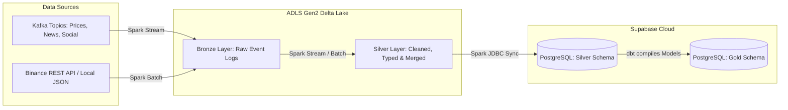
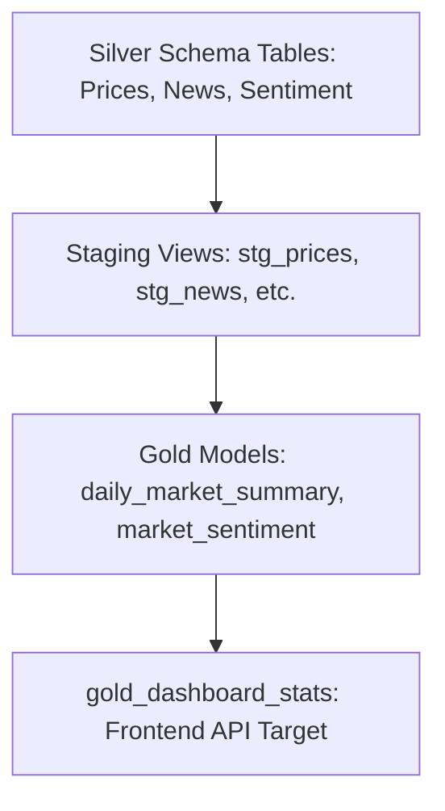

# Data Processing & Modeling Layer

This directory forms the core data engineering hub of the **Crypto-Pulse** pipeline. It is divided into two primary sub-components:
1.  **`spark_jobs/`**: Data ingestion, cleansing, structured stream merges, and ML sentiment application using **Apache Spark / PySpark**.
2.  **`dbt/`**: Analytics engineering, business aggregations, and data quality testing using **dbt (Data Build Tool)**.

---

## Directory Structure

```
processing/
├── dbt/                          # dbt Project config and models
│   ├── dbt_project.yml           # Project metadata settings
│   ├── profiles.yml              # Connection profile mappings to Postgres
│   ├── models/                   # SQL queries (staging views + gold tables)
│   └── tests/                    # Data quality assertions (SQL tests)
└── spark_jobs/                   # PySpark data processing jobs
    ├── bronze_*.py               # Kafka-to-Bronze streaming consumers
    ├── historical_loader.py      # Historical JSON loader
    ├── silver_*.py               # Cleansing & schema normalization processors
    ├── sync_*_pg.py              # ADLS Gen2-to-PostgreSQL JDBC synchronizers
    ├── sentiment_processor.py    # PySpark-FinBERT sentiment extraction
    └── supabase_utils.py         # SSL-compliant JDBC connection manager
```

---

## Medallion Architecture & Spark Pipelines

The pipeline implements a **Medallion Lakehouse Architecture** on **Azure ADLS Gen2** stored as **Delta Tables**:



### 1. The Bronze Layer (Raw Storage)
Stores raw event payloads exactly as received from Kafka or local files.
*   `bronze_consumer.py`: Structured stream reading from `crypto.realtime.prices` and writing to `bronze/prices` Delta table every 30s.
*   `bronze_news_consumer.py` & `bronze_social_consumer.py`: Consumes news/social streams and writes to `bronze/news` & `bronze/social`.
*   `historical_loader.py`: Reads Binance historical JSON arrays, formats columns, and writes to `bronze/historical`.

### 2. The Silver Layer (Clean & Structured)
Applies cleansing rules, converts timestamps, deduplicates events, and merges into the Silver Delta lake.
*   `silver_prices_processor.py`: Parses JSON schema, filters out nulls, drops duplicates, and runs a **Delta MERGE (Upsert)** into `silver/prices` on `(symbol, event_time)`.
*   `silver_historical_processor.py`: Normalizes daily candlestick data and writes to `silver/historical` partitioned by symbol and date.
*   `silver_news_processor.py` & `silver_social_processor.py`: Normalizes news and RSS feeds schema, aligning timestamps to proper UTC format.
*   `sentiment_processor.py`: Pulls news headlines, runs **FinBERT sentiment predictions**, tags cryptocurrency symbols, and outputs results.

### 3. PostgreSQL Sync (JDBC)
Reads Delta tables from ADLS Gen2 and writes them to PostgreSQL.
*   `sync_prices_pg.py`, `sync_historical_pg.py`, `sync_news_pg.py`, `sync_social_pg.py`: Uses Spark JDBC writer.
*   `supabase_utils.py`: Constructs target configurations, forcing secure SSL handshakes (`sslmode=require`) to safely reach Supabase Cloud.

---

## Analytics Modeling with dbt

Once data lands in the relational store, **dbt** is triggered to build staging views and materialize gold models.



### Staging Views (Folder `dbt/models/staging/`)
Lightweight views that cast strings to decimal numbers, clean columns, and format date definitions:
*   `stg_prices.sql`: Casts streaming prices to `DECIMAL(18,8)`.
*   `stg_historical.sql`: Cleans Binance historical candlesticks.
*   `stg_news.sql` & `stg_social.sql`: Standardizes news metadata.
*   `stg_news_sentiment.sql`: Formats FinBERT scores and labels.

### Gold Tables (Folder `dbt/models/gold/`)
Materialized reporting tables optimized for backend API and frontend dashboard consumption:
*   `daily_market_summary.sql`: Compiles daily Open, High, Low, Close, Volume aggregates.
*   `market_sentiment.sql`: Aggregates sentiment scores per coin per day, computing `avg_sentiment_score` and labelling the overall `market_mood` (e.g. Bullish, Bearish, Neutral).
*   `gold_dashboard_stats.sql`: Combines the latest market metrics with AI sentiment scores using a `FULL OUTER JOIN` to build a single summary endpoint for the dashboard interface.

---

## Data Quality Tests (Folder `dbt/tests/`)
Asserts database integrity guidelines at build-time:
*   `assert_low_price_less_than_high_price.sql`: Validates that low prices are always smaller than or equal to high prices.
*   `assert_no_duplicate_symbol_date.sql`: Guarantees daily uniqueness for coin history.
*   `assert_total_volume_positive.sql`: Prevents negative volume inputs.
*   `assert_sentiment_score_range.sql`: Checks that FinBERT output scores stay within `[-1.0, 1.0]`.
